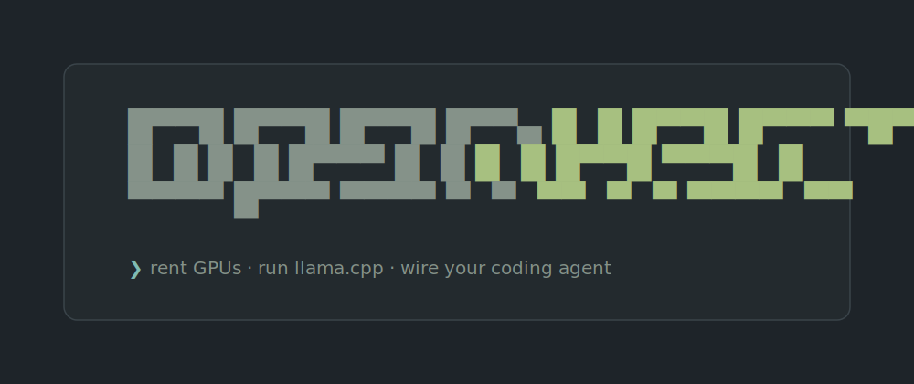

<div align="center">



**A muted terminal dashboard for renting [vast.ai](https://vast.ai) GPUs, running [llama.cpp](https://github.com/ggml-org/llama.cpp) models, and wiring them into your coding agent.**

[](LICENSE)
[](https://www.python.org)
[](https://textual.textualize.io)

</div>

---

openvast finds the cheapest GPU that fits a model, spins it up on vast.ai running
`llama.cpp`, watches it come alive (image pull → model download % → weights →
healthy), and automatically wires the live OpenAI-compatible endpoint into
[opencode](https://github.com/opencode-ai/opencode) — so a cheap rented GPU
becomes a model in your coding agent. When you pause or delete the instance, it
un-wires itself.

```
  █▀▀█ █▀▀█ █▀▀█ █▀▀▄ █  █ █▀▀█ █▀▀▀ ▀█▀▀
  █  █ █  █ █▀▀▀ █  █ █  █ █▀▀█ ▀▀▀█  █
  ▀▀▀▀ █▀▀▀ ▀▀▀▀ ▀  ▀  ▀▀  ▀  ▀ ▀▀▀▀  ▀▀

  ID        GPU           Model             Status          Health  tok/s  kv t/s  $/hr    Up     OC
  43780544  RTX 5090 32G  gemma-4-26b-a4b   healthy         ● ok    172    2960    $0.42   0h14m  ✓
  43779302  RTX 4090 24G  qwen3.6-35b-a3b   downloading 62% ○ —     —      —       $0.34   0h03m
```

## Features

- **Launch on the cheapest GPU that fits** — pick a model, and openvast shows
  only the vast.ai offers with enough VRAM (and reachable direct ports),
  cheapest first.
- **Live start progress** — a real download **percentage** during the model
  pull, plus a per-second timer through every phase:
  `provisioning → pulling → downloading % → loading → healthy` (or `error`).
- **Throughput metrics** — generation **tok/s** and prefill **kv t/s** read live
  from each server's `/metrics`.
- **Cost monitor** — current balance, live `$/hr`, and spend over the last
  **24h / 7d / 30d**.
- **Auto opencode wiring** — every healthy instance becomes an `openvast · <gpu>`
  provider (correct per-GPU routing); removed when it stops being healthy.
- **Pause / resume / delete** with confirmation; failed hosts surface as `error`
  with the vast message in the detail view.
- **Muted, keyboard-first UI** — Everforest palette, semantic colors paired with
  symbols (readable in monochrome), `NO_COLOR` honored, responsive columns, and
  a "terminal too small" floor.

## Install

**One line, no prerequisites** (bootstraps [uv](https://docs.astral.sh/uv/) +
Python + the `vastai` CLI + openvast, and generates an SSH key):

```bash
curl -fsSL https://raw.githubusercontent.com/dimavedenyapin/openvast/main/install.sh | sh
```

Then authenticate vast.ai and run it:

```bash
vastai set api-key <YOUR_KEY>     # key from https://cloud.vast.ai/account/
openvast
```

<details>
<summary>Already have a Python toolchain? Other install methods</summary>

```bash
# uv
uv tool install git+https://github.com/dimavedenyapin/openvast
uv tool install vastai

# or pipx
pipx install git+https://github.com/dimavedenyapin/openvast
pipx install vastai
```

Run with `openvast` (or `python3 -m openvast`).
</details>

### Requirements

The one-line installer handles all of these except your vast.ai key:

| Tool | Why | Handled by installer |
|---|---|---|
| [`vastai`](https://pypi.org/project/vastai/) CLI, authenticated | manage GPU instances | installs it; **you** run `vastai set api-key <KEY>` |
| Python 3.11+ | runtime | ✅ (via uv) |
| SSH key at `~/.ssh/id_rsa(.pub)` | attach to instances + logs / download-% viewer | ✅ generated if missing |
| [opencode](https://github.com/opencode-ai/opencode) | auto-wiring + launch/pause are gated on it | optional — `curl -fsSL https://opencode.ai/install \| bash` |

Without a vast.ai key or opencode, openvast still runs in read-only **monitor**
mode — a banner explains what's disabled.

## Usage

| Key | Action | | Key | Action |
|---|---|---|---|---|
| `n` | launch a model | | `Enter` | instance details |
| `p` | pause (stop) | | `l` | logs / start progress (SSH) |
| `r` | resume (start) | | `q` | quit |
| `d` | delete (destroy) | | `Ctrl+P` | command palette |

The table auto-refreshes every 60s (every 10s while anything is loading). There
is no manual refresh key by design.

## Models

Models live in [`openvast/models.yaml`](openvast/models.yaml) — no code change
needed to add one. Anything under `defaults` applies to every model unless
overridden. Override the file with `VAST_MODELS_FILE=/path.yaml`, or drop a
`models.yaml` in your working directory.

```yaml
defaults:
  image: vastai/llama-cpp:b9628-cuda-12.9
  extra_args: "--jinja -fa on --cache-type-k q8_0 --cache-type-v q8_0 --metrics"
default_model: qwen3.6-35b-a3b
models:
  - key: qwen3.6-35b-a3b
    name: Qwen3.6 35B A3B (Q4)
    hf: unsloth/Qwen3.6-35B-A3B-GGUF:UD-Q4_K_M
    min_vram_gb: 24        # offers below this VRAM are hidden in the launch flow
    disk_gb: 80
    context: 65536
```

Ships with ~19 curated models across the **16 / 24 / 32 / 48 / 80 / 96 GB**
tiers (Qwen3.6, Qwen3-Coder, Qwen3-Next, gpt-oss, Gemma, Mistral, Devstral,
Llama, GLM-4.5-Air, …), each with a verified GGUF size and VRAM requirement.
Per-model keys: `name`, `hf`, `min_vram_gb`, `disk_gb`, `context`, `port`,
`image`, `extra_args`, `output_limit`, `tool_call`, `reasoning`.

## Configuration

Environment variables override defaults:

| Variable | Default | Description |
|---|---|---|
| `SSH_KEY` / `SSH_PUB_KEY` | `~/.ssh/id_rsa(.pub)` | SSH key pair |
| `OPENCODE_CONFIG` | `~/.config/opencode/opencode.json` | opencode config path |
| `VAST_MODELS_FILE` | shipped `models.yaml` | model registry |
| `VAST_IMAGE` | `vastai/llama-cpp:b9628-cuda-12.9` | default container image |
| `MIN_RELIABILITY` | `0.98` | minimum offer reliability |
| `MIN_CUDA` | `12.8` | minimum CUDA version |
| `MIN_DIRECT_PORTS` | `2` | require reachable direct ports (else the API is unreachable) |
| `EXCLUDE_GEOS` | `CN` | comma-separated geolocations to exclude |
| `NO_COLOR` | (unset) | disable colors (monochrome) |

## How opencode wiring works

Each healthy instance becomes its own provider keyed `openvast-<id>`, displayed
as `openvast · <gpu>`, with that instance's endpoint as the provider `baseURL`.
Selecting it routes to that exact GPU. opencode has no per-model `baseURL`
override yet ([opencode#11287](https://github.com/anomalyco/opencode/issues/11287)),
so a single provider can't fan out to multiple endpoints — one provider per GPU
is the reliable design. When you run a single GPU (the common case) there's a
single `openvast-<id>` provider.

## Notes & caveats

- **Direct ports:** openvast only launches on hosts with reachable direct ports
  (`MIN_DIRECT_PORTS`), otherwise the model API can't be reached and the
  instance would appear stuck loading forever.
- **Image pulls** on hosts that haven't cached the `vastai/llama-cpp` image can
  take several minutes — shown as `pulling`.
- **Reasoning models** (e.g. Qwen3.6) stream `reasoning_content` before the
  final answer; that's expected, not a hang.
- The first request to a fresh server includes a one-time CUDA-graph warmup
  (tens of seconds); openvast keeps client timeouts disabled.

## Legacy shell script

[`vast-qwen4090.sh`](vast-qwen4090.sh) is the original no-TUI approach
(`create` / `destroy` / `sync-opencode` from the shell). It's independent of the
Python package and kept for scripting use.

## License

[MIT](LICENSE) © Dmitry Vedenyapin
